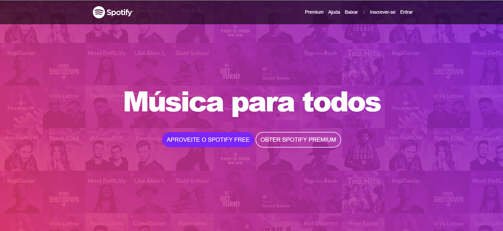

# Música para Todos - Spotify

Este projeto é uma landing page inspirada no Spotify, com o objetivo de demonstrar um design simples e funcional utilizando HTML, CSS e Bootstrap. A página apresenta uma interface de marketing para o serviço de streaming, destacando os benefícios do Spotify Free e Premium, além de oferecer informações sobre recursos, playlists e novos lançamentos.

## Funcionalidades

- **Design Responsivo**: A página se adapta a diferentes tamanhos de tela, desde desktops até dispositivos móveis.
- **Interface Atraente**: Utiliza o framework Bootstrap para um layout moderno e fácil de navegar.
- **Links Interativos**: Oferece botões para ações como "Aproveitar o Spotify Free" e "Obter Spotify Premium", simulando a experiência de navegação no site oficial do Spotify.

## Tecnologias Utilizadas

- **HTML5**: Estrutura da página e conteúdo.
- **CSS**: Estilos personalizados para o layout.
- **Bootstrap 4**: Framework CSS para garantir responsividade e design moderno.
- **Font Awesome**: Ícones sociais e de navegação.

